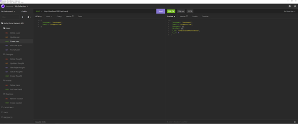

# NoSQL-Social-Network-API [](https://opensource.org/licenses/MIT)

## Description
<p> This application was created for a social network API where users can share their thoughts, react to friends’ thoughts, and create a friend list. Express.js is used for the routing, MongoDB for the database, and Mongoose as the Object Data Model.</p>

<p>This application was created with [Node.js](https://nodejs.org/en/). The modules used include:</p>

- [express](https://expressjs.com/)
- [mongoose](https://mongoosejs.com/).
    
## Table of Contents 
- [Screenshots](#Screenshots)
- [Installation](#Installation)
- [Usage](#Usage)
- [License](#License)
- [Contribution](#Contribution)
- [Tests](#Tests)
- [Questions](#Questions)
- [Links](#Links)

## Screenshots

<p>Get all users</p>

- 

<p>Create user</p>

- 

<p>Create Thought</p>

- 

<p>Delete Thought</p>

- 

<p>Create reaction</p>

- 


## Installation 
<p>To install this application please follow these instructions:</p>

- Please have node and npm installed.
- The application will be invoked by using the following command:

 ```
  git clone git@github.com:seanscott95/NoSQL-Social-Network-API.git
 ```
- Please run ```npm i``` to install the node modules needed for this application.
- To start, make sure your are in the root repository and run ```npm start``` to connect to the server.

## Usage 
- Please see the video demo below for usage instructions.

## License 
<p> This application is covered under the:</p>

- [MIT-License](https://opensource.org/licenses/MIT)

## Contribution 
<p> None.</p>

## Tests 
<p> This application was not developed using Test Driven Development.</p>

## Questions 
<p> To reach me with additional questions please contact me via one of the following methods: </p>

- GitHub: [GitHub](https://github.com/seanscott95)
- Email: [Email](mailto:seanms418@gmail.com)
- LinkedIn: [LinkedIn](https://www.linkedin.com/in/sean-scott-18ba07225/)

## Links
- GitHub: [GitHub](https://github.com/seanscott95/NoSQL-Social-Network-API)
- Video Demo 1 (5min): [Video-demo-1](https://drive.google.com/file/d/1tPBQuYIUq_NJp3XgXrDzNpEoy45Q-6la/view)
- Video Demo 2 (1:40min): [Video-demo-2](https://drive.google.com/file/d/1xjKqK16SbIZ0c8k6m6d5xSx27lZ2jtIT/view)